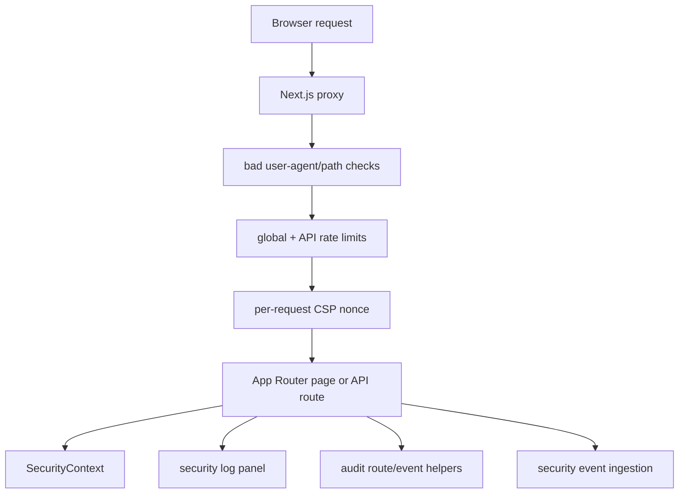

# FrontGuard Architecture

FrontGuard is a frontend security playground for teaching and testing browser-side security mistakes. It is intentionally interactive: each module lets a developer run an unsafe implementation, switch to the secure implementation, and inspect the difference through UI state, route handlers, logs, and security headers.

## Product Boundary

The app is not a scanner and it is not a production identity provider. It is an educational security product with production-grade engineering signals:

- Vulnerable and secure examples side by side.
- Real API route behavior for auth, logs, and RBAC examples.
- Shared security context and event log.
- Nonce-based CSP in production.
- Route-level rate limiting and request IDs.
- Suite v2 event ingestion prototype for FrontGuard Agent findings.
- Unit tests for security utilities.
- Playwright smoke tests for the highest-risk flows.

The companion package, `frontguard-agent`, is the runtime detection story. This app is the teaching and demonstration layer. The broader ecosystem narrative lives in [FrontGuard Suite](./FRONTGUARD_SUITE.md).

## Request Flow

`proxy.ts` is the platform boundary. It adds request IDs, applies coarse rate limits, blocks obvious scanner traffic, generates the CSP nonce, forwards that nonce to App Router, and attaches security headers to the response.

## Module Architecture

Each security module is a self-contained route:

- `/xss` demonstrates unsafe `innerHTML` versus escaped text rendering.
- `/auth` demonstrates localStorage token exposure versus httpOnly-style secure storage.
- `/api-security` demonstrates unauthenticated PII exposure versus token-protected, redacted, rate-limited responses.
- `/rbac` demonstrates frontend-only role checks versus server-verified role claims.
- `/devtools` demonstrates why business rules cannot live only in the DOM or browser globals.

Shared UI lives under `components/`:

- `AppShell`, `Sidebar`, `Topbar`, and `LogsPanel` define the product frame.
- `HintBar`, `InfoPanel`, `StatusPanel`, and primitives keep module education consistent.
- `OnboardingModal` makes the first-run experience guided without changing the module logic.

The `/security-events` route is the first FrontGuard Suite v2 surface. It consumes the same event envelope described in `frontguard-agent`, calls `POST /api/security-events`, resolves org/project metadata, and presents recent findings as a tenant-scoped triage queue.

## Security Utilities

`lib/security/` owns reusable behavior:

- HTML escaping and threat detection.
- Mock token generation/decoding for demos.
- Role permission checks.
- In-memory rate limiting.
- Audit event creation and event context.
- FrontGuard Agent event-envelope validation, sanitization, optional scoped write-token authorization, memory/Redis REST storage, retention policy, summary stats, and workspace filtering.

The tokens and rate limits are intentionally simple because the app is a playground. The event ingestion path is shaped like a SaaS boundary: CORS allowlisting, optional scoped write tokens, optional admin token for clearing streams, Redis-backed retention, and audit logging. The documentation and UI call out where a real product would add signed JWT/session cookies, project RBAC, durable audit storage, and a real identity provider.

## CSP Design

Production uses a nonce-bearing Content Security Policy:

- `script-src 'self' 'nonce-...'`
- `object-src 'none'`
- `frame-ancestors 'none'`
- `base-uri 'self'`
- strict referrer, permissions, content-type, and frame headers

The App Router layout reads the request nonce so Next.js runtime scripts can hydrate without falling back to broad `unsafe-inline`. Routes render dynamically where needed so each response can receive a fresh nonce.

## State Model

`SecurityContext` owns the interactive playground state:

- Attack versus secure mode.
- Current user and role.
- Security events shown in the log panel.
- Exploit counters and module-level context.

This state stays client-side because the goal is interactive demonstration. API routes still enforce server-side examples where the module is specifically teaching server enforcement.

## Testing Strategy

Unit tests cover security primitives:

- HTML sanitization/escaping.
- Input threat detection.
- Rate-limit behavior.
- Mock token handling.
- RBAC permission checks.
- Security event envelope validation, sanitization, ingestion summaries, and severity filtering.

Playwright smoke tests cover production behavior:

- Landing page and dashboard shell.
- Mode switching.
- XSS attack and secure rendering paths.
- API leak and protected behavior.
- Security event dashboard ingestion flow.
- CSP nonce/header behavior indirectly through production hydration.

## Production Hardening Path

If FrontGuard became a real security education SaaS platform, the next backend layer would include:

- Auth provider integration.
- Postgres-backed learning progress.
- Durable audit/event storage.
- Redis/Upstash rate limits.
- Per-organization modules and assignments.
- Real CSP report ingestion and FrontGuard Agent event ingestion.
- Admin dashboard for vulnerable-pattern analytics and runtime event triage.

The suite roadmap expands this into event ingestion, triage dashboards, organization workflows, and a clean contract between the browser package and the SaaS backend.

## Interview Talking Points

- Why the app intentionally contains unsafe code paths and how they are isolated.
- Why client-side role checks are cosmetic and route handlers must enforce policy.
- How the nonce CSP works with Next.js App Router.
- Why demo tokens are marked as mock behavior.
- How rate limiting differs between playground state and production enforcement.
- How the companion `frontguard-agent` completes the education-to-detection story.
- How a future ingestion API would consume agent events without coupling the browser package to one backend.
- Why the event store defaults to memory locally, how the Redis REST adapter changes persistence behavior, how write-token scopes and retention policies work, and where a production database or stream boundary would live.
