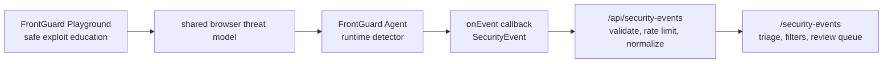

# FrontGuard Suite

FrontGuard is designed as a small product ecosystem for frontend security education and runtime visibility. The playground teaches developers how browser-side attacks work. The agent turns the same threat model into production-style telemetry.

## Product Thesis

Most frontend security tools either scan source code in isolation or report browser problems after they have already reached production. FrontGuard is built around a tighter learning loop:

1. Trigger the exploit safely in the playground.
2. Compare the vulnerable and secure implementations.
3. Ship a lightweight runtime agent that detects the same class of behavior.
4. Send structured events to a future ingestion API and investigation dashboard.

That makes the suite useful as a portfolio product because it demonstrates product thinking, frontend engineering, security reasoning, package design, observability, and a realistic SaaS expansion path.

## Suite Map

| Surface | Status | Audience | Job |
|---|---|---|---|
| [FrontGuard Playground](https://github.com/codejupiter/frontguard) | Live app | Frontend teams, junior engineers, security-minded product teams | Teach XSS, auth storage, API exposure, RBAC, and client-side bypasses with safe interactive demos. |
| [FrontGuard Agent](https://github.com/codejupiter/frontguard-agent) | Package-ready demo | SaaS teams, platform teams, security-conscious frontend teams | Detect script injection, iframe injection, and suspicious DOM mutations inside real browser sessions. |
| Event ingestion API | Prototype | Security/product engineering teams | Accept agent events, validate payloads, authorize writes, alert on critical findings, and store normalized security signals. |
| Security operations dashboard | Prototype | Engineering managers, app owners, security reviewers | Triage events by severity, application, session, project scope, source, browser, and release. |

## Current Live Surfaces

- Playground: [frontguard-nine.vercel.app](https://frontguard-nine.vercel.app)
- Agent demo: [frontguard-agent.vercel.app](https://frontguard-agent.vercel.app)
- Event triage prototype: `/security-events`
- Agent demo telemetry stream: `/security-events?orgId=frontguard-labs&projectId=agent-demo&appId=frontguard-agent-demo`
- Security event case study: [Security Event Architecture](./SECURITY_EVENT_ARCHITECTURE.md)

## Architecture Direction



The playground and agent should remain separate projects. That separation keeps the playground free to include intentionally vulnerable examples while the agent stays package-quality, small, dependency-light, and safe to embed in real applications.

## Event Contract

The agent already emits a stable `SecurityEvent` shape:

```ts
interface SecurityEvent {
  type:
    | 'dom.script-injected'
    | 'dom.iframe-injected'
    | 'dom.suspicious-attribute';
  severity: 'low' | 'medium' | 'high' | 'critical';
  timestamp: number;
  url: string;
  details: Record<string, unknown>;
}
```

The current prototype accepts these events at `POST /api/security-events` inside a workspace-scoped envelope. The hosted `frontguard-agent` demo is allowlisted to submit browser telemetry through CORS, while local playground requests continue to work same-origin:

```ts
interface FrontGuardEventEnvelope {
  orgId?: string;
  projectId?: string;
  appId: string;
  environment: 'production' | 'preview' | 'development';
  release?: string;
  sessionId?: string;
  userId?: string;
  events: SecurityEvent[];
}
```

That boundary keeps the browser package privacy-aware and transport-agnostic while letting the SaaS layer handle tenancy, retention, analytics, alerting, and access control. The prototype stores recent events in memory for local development and uses Redis REST when Vercel/Upstash `KV_REST_API_*`, `UPSTASH_REDIS_REST_*`, or `FRONTGUARD_REDIS_REST_*` credentials are present. `FRONTGUARD_EVENT_STORE_KEY` can isolate environments that share the same Redis database, while `FRONTGUARD_EVENT_MAX_EVENTS` and `FRONTGUARD_EVENT_RETENTION_DAYS` bound storage growth.

`POST /api/security-events` remains open to trusted demo origins until `FRONTGUARD_EVENT_WRITE_TOKENS` is configured. When configured, callers must send `Authorization: Bearer <token>` or `x-frontguard-event-token`. Token scopes use `*=token`, `org=token`, `org/project=token`, or `org/project/app=token`. `DELETE /api/security-events` can be protected separately with `FRONTGUARD_ADMIN_TOKEN`.

`GET /api/security-events` remains open for portfolio demos until `FRONTGUARD_PROJECT_ACCESS_TOKENS` is configured. Read tokens use `scope:role=token`, where roles are `viewer`, `triager`, or `admin` and scopes are `*`, `org`, `org/project`, or `org/project/app`. Successful scoped reads are narrowed server-side before events are returned.

Critical alerting is environment-driven. Without `FRONTGUARD_ALERT_WEBHOOK_URL`, matching events produce audit-only alert records. With a webhook URL, FrontGuard posts a compact alert payload for events at or above `FRONTGUARD_ALERT_MIN_SEVERITY` and treats delivery failures as audit events instead of failing ingestion.

For local or alternate hosted demos, set `FRONTGUARD_EVENT_ORIGINS` to a comma-separated list of trusted origins that may POST event envelopes.

## Roadmap

| Phase | Outcome | Engineering Signal |
|---|---|---|
| 1. Education | Playground with attack and secure modes | Next.js App Router, security headers, route handlers, responsive product UI, Playwright smoke tests. |
| 2. Runtime package | Agent with typed API and small bundle | TypeScript library design, MutationObserver lifecycle, package exports, compatibility docs, dry-run packaging. |
| 3. Ingestion | Event API prototype with durable storage | Authenticated API design, schema validation, scoped writes, retention, alert dispatch, database modeling. |
| 4. Dashboard | Security triage workspace prototype | Project-scoped reads, data visualization, filtering, severity workflows, realtime updates, accessibility. |
| 5. Organization layer | Teams, projects, policies, reports | RBAC, audit logs, billing-ready product boundaries, compliance-friendly documentation. |

## Differentiation

FrontGuard should not become a generic security scanner. The strongest positioning is narrower and sharper:

- It teaches frontend-specific mistakes with real UI and route behavior.
- It detects runtime browser mutations that static analysis cannot see.
- It connects education, prevention, and telemetry into one product story.
- It is small enough to reason about in interviews but deep enough to discuss architecture tradeoffs.

## Interview Talking Points

- Why the playground intentionally contains unsafe code and how that risk is isolated.
- Why the runtime agent is a separate package instead of being embedded in the playground.
- How the event contract supports a future SaaS backend without forcing transport decisions into the browser package.
- Why CSP, server-side authorization, and runtime detection solve different parts of the security problem.
- How the roadmap expands from frontend demo to fullstack product without rewriting the first two projects.
