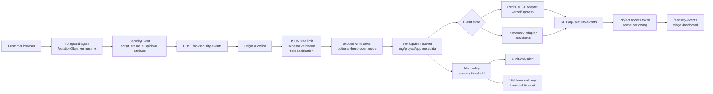
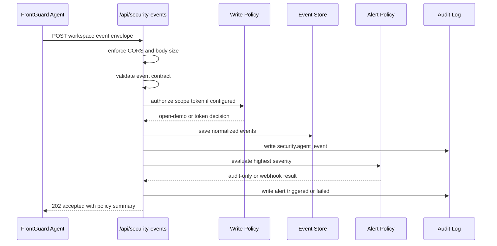
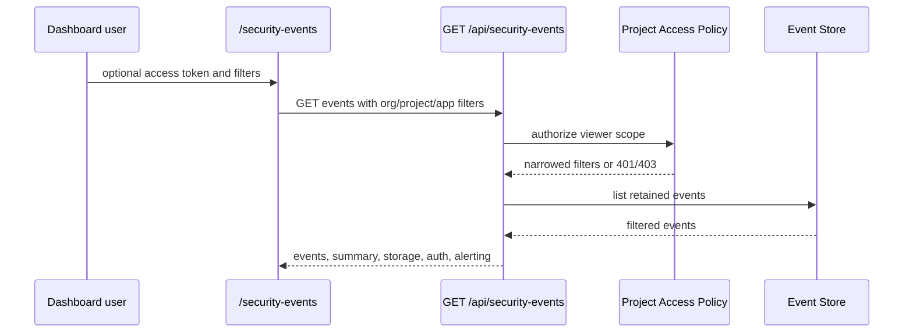

# FrontGuard Security Event Architecture

FrontGuard's security event system turns the playground and companion agent into a small SaaS-style observability product. The goal is not to clone a security platform. The goal is to show how a frontend/fullstack engineer can design a production-shaped event pipeline with tenant boundaries, storage adapters, policy-driven access, alerting, tests, and clear operational tradeoffs.

## Executive Summary

FrontGuard Agent detects suspicious DOM mutations in the browser. FrontGuard accepts those events through `/api/security-events`, validates and normalizes them, stores recent findings in memory or Redis REST, exposes a triage dashboard, narrows reads by project scope, and records critical alerts through audit-only or webhook delivery.

This is the full product loop:

1. The playground teaches the security failure mode.
2. The agent detects that class of failure at runtime.
3. The API ingests typed event envelopes.
4. The dashboard lets an operator triage project-specific findings.
5. The policy layer controls writes, reads, retention, and alerts.

## System Diagram



## Request Flow

### Write Path



### Read Path



## Code Map

| Area | File | Responsibility |
|---|---|---|
| Route boundary | `app/api/security-events/route.ts` | CORS, request parsing, auth decisions, persistence, alert dispatch, response shape. |
| Dashboard | `app/security-events/page.tsx` | Triage UI, workspace filters, access-token input, retention/auth/alerting status. |
| Ingestion | `lib/security/eventIngestion.ts` | Event contract validation, sanitization, workspace resolution, memory/Redis adapters, summaries, retention. |
| Write auth | `lib/security/eventWriteAuth.ts` | Optional scoped write tokens and admin token checks. |
| Read auth | `lib/security/eventProjectAccess.ts` | Optional project access tokens, role rank, server-side filter narrowing. |
| Alerting | `lib/security/eventAlerts.ts` | Severity threshold, audit-only fallback, webhook payload, timeout-bounded delivery. |
| Audit | `lib/security/auditLog.ts` | Security event, storage, RBAC, and alert audit records. |

## Event Contract

The browser agent emits a small runtime event. The SaaS layer wraps that event in workspace context:

```ts
interface FrontGuardEventEnvelope {
  orgId?: string;
  projectId?: string;
  appId: string;
  environment: "production" | "preview" | "development";
  release?: string;
  sessionId?: string;
  userId?: string;
  events: Array<{
    type:
      | "dom.script-injected"
      | "dom.iframe-injected"
      | "dom.suspicious-attribute";
    severity: "low" | "medium" | "high" | "critical";
    timestamp: number;
    url: string;
    details: Record<string, unknown>;
  }>;
}
```

The API normalizes each event with generated IDs, request IDs, source metadata, resolved org/project names, receive time, and sanitized detail fields. That keeps the agent lightweight while letting the backend own tenancy, retention, and operator workflows.

## Security Boundaries

| Boundary | Current behavior | Why it matters |
|---|---|---|
| CORS | Only same-origin, local dev origins, the hosted agent demo, and configured origins may submit events. | Prevents arbitrary sites from using the ingestion route as an open collection endpoint. |
| Body size | JSON body parsing is capped at 20 KB. | Keeps the route from becoming an unbounded payload sink. |
| Envelope validation | Event type, severity, environment, URL, identifiers, batch size, and detail shape are validated. | Stops malformed client data from becoming trusted backend state. |
| Field sanitization | Identifiers and details are sanitized and truncated. | Reduces log and UI injection risk. |
| Write tokens | `FRONTGUARD_EVENT_WRITE_TOKENS` can require scoped ingestion tokens. | Lets a real deployment restrict which app can write events for which workspace. |
| Read tokens | `FRONTGUARD_PROJECT_ACCESS_TOKENS` can require scoped viewer, triager, or admin tokens. | Prevents cross-project event leaks and demonstrates tenant-aware reads. |
| Scope narrowing | A valid read token narrows filters server-side before storage is queried. | The client cannot widen its own access by changing query params. |
| Retention | Storage is bounded by count and optional days. | Keeps Redis memory and demo data growth under control. |
| Alert timeout | Webhook delivery is bounded between 500 ms and 10 seconds. | Alert destinations cannot hold ingestion indefinitely. |
| Alert failure handling | Webhook errors are audited but do not fail ingestion. | A monitoring outage should not drop the original security evidence. |

## Environment Contract

| Variable | Purpose |
|---|---|
| `FRONTGUARD_EVENT_ORIGINS` | Additional trusted origins for event submission. |
| `KV_REST_API_URL`, `KV_REST_API_TOKEN` | Vercel Marketplace Upstash Redis credentials. |
| `FRONTGUARD_REDIS_REST_URL`, `FRONTGUARD_REDIS_REST_TOKEN` | Explicit Redis REST aliases for non-marketplace setups. |
| `FRONTGUARD_EVENT_STORE_KEY` | Redis key namespace for isolating environments. |
| `FRONTGUARD_EVENT_MAX_EVENTS` | Maximum retained events. |
| `FRONTGUARD_EVENT_RETENTION_DAYS` | Retention window. Use `0` for count-only retention. |
| `FRONTGUARD_EVENT_WRITE_TOKENS` | Scoped write tokens: `*=token`, `org=token`, `org/project=token`, `org/project/app=token`. |
| `FRONTGUARD_PROJECT_ACCESS_TOKENS` | Scoped read tokens: `scope:role=token` where role is `viewer`, `triager`, or `admin`. |
| `FRONTGUARD_ADMIN_TOKEN` | Optional admin token for clearing the event stream. |
| `FRONTGUARD_ALERT_WEBHOOK_URL` | Optional webhook destination for alert payloads. |
| `FRONTGUARD_ALERT_WEBHOOK_TOKEN` | Optional bearer token for the alert webhook. |
| `FRONTGUARD_ALERT_MIN_SEVERITY` | Alert threshold: `low`, `medium`, `high`, or `critical`. |
| `FRONTGUARD_ALERT_TIMEOUT_MS` | Webhook timeout, clamped to a safe range. |

## Design Decisions And Tradeoffs

| Decision | Why this design | Tradeoff |
|---|---|---|
| Separate playground and agent repos | The playground can include intentionally vulnerable demos while the agent stays package-quality and safe to embed. | Cross-repo coordination requires extra documentation and smoke checks. |
| Next.js route handler for ingestion | Keeps the portfolio product deployable on Vercel with minimal infrastructure. | A high-volume production system would likely move ingestion to a dedicated service or queue-backed worker. |
| Redis REST adapter | Fits Vercel/Upstash deployment and proves durable storage without a database migration layer. | Redis lists are great for recent-event triage, not long-term analytics or complex querying. |
| Memory fallback | Makes local development and CI deterministic without external services. | Local events disappear on restart and are not shared across processes. |
| Environment-driven tokens | Shows real policy boundaries without forcing a full auth provider into a portfolio demo. | Production would use managed identity, JWT/session auth, per-user roles, and secret rotation. |
| Server-side scope narrowing | Keeps access control in the API instead of trusting dashboard filters. | Requires careful parser tests so token scopes cannot accidentally broaden reads. |
| Audit-only alert default | Demo deployments keep working without a webhook provider. | A production team would route alerts into Slack, PagerDuty, email, or an incident system. |
| Webhook failures do not block ingestion | Security evidence is more important than alert destination availability. | Operators need audit visibility so failed alerts are not silently ignored. |

## Failure Modes

| Failure | Response |
|---|---|
| Untrusted origin submits events | `403` with CORS-safe response. |
| Body is too large or invalid JSON | `400` and `input.validation_failure` audit event. |
| Envelope fields are invalid | `400` with validation errors. |
| Write token is missing or out of scope | `401` or `403` and security audit event. |
| Read token is missing or out of scope | `401` or `403` and `rbac.access_denied` audit event. |
| Redis is unavailable | `503` for affected storage operation. |
| Alert webhook times out or returns non-2xx | Ingestion still succeeds, and `security.alert_failed` is audited. |

## Testing Strategy

| Test file | Coverage |
|---|---|
| `lib/security/eventIngestion.test.ts` | Envelope validation, sanitization, ingestion, summaries, filtering, retention bounds. |
| `lib/security/eventWriteAuth.test.ts` | Scoped write tokens, admin token behavior, non-secret summaries. |
| `lib/security/eventProjectAccess.test.ts` | Open demo mode, required read tokens, scope narrowing, role rank, non-secret summaries. |
| `lib/security/eventAlerts.test.ts` | Alert policy defaults, severity threshold, audit-only behavior, webhook payload, webhook error handling. |
| `tests/smoke/frontguard.smoke.ts` | Production dashboard route, sample event ingestion, desktop and mobile smoke coverage. |

## Scaling Path

At 10x traffic:

- Move event ingestion behind a durable queue so user-facing writes return quickly.
- Store canonical events in Postgres or ClickHouse for long-term analytics.
- Keep Redis for hot recent-event lists and rate limits.
- Add per-project quotas, ingestion rate limits, and replay protection.
- Use signed project tokens or managed OAuth/OIDC instead of static env tokens.
- Add a real audit sink such as Datadog, Sentry, Axiom, or OpenTelemetry.
- Add dashboard pagination, cursor-based APIs, and server-side search.
- Add real-time updates through SSE, WebSockets, or polling with ETags.
- Add alert routing rules per project, severity, environment, and release.

At 100x traffic:

- Split ingestion, policy evaluation, alert delivery, and query APIs into separate services.
- Process alerts asynchronously with retries and dead-letter handling.
- Partition events by organization and time window.
- Add data lifecycle jobs for compliance deletion and retention enforcement.
- Move access control to a central authorization layer with user, org, project, and service-token subjects.

## Interview Talking Points

Use these as concise answers in interviews:

| Question | Strong answer |
|---|---|
| What problem does this solve? | It closes the loop between teaching frontend security issues and detecting those issues in runtime browser sessions. |
| Why not keep this client-only? | The browser is untrusted. Tenancy, storage, authorization, retention, and alerting must be enforced server-side. |
| How do you prevent cross-tenant reads? | Read tokens are scoped to org, project, or app. The API merges token scope with requested filters and rejects conflicting filters before querying storage. |
| Why does webhook failure not fail ingestion? | The event itself is the source evidence. Alert delivery is secondary and should be retried or audited without dropping the original signal. |
| Why Redis REST? | It is a pragmatic deployment fit for recent-event triage on Vercel. It proves a storage boundary while keeping the project easy to run. |
| What would you change in production? | Add managed auth, durable event storage, async queues, project quotas, persistent audit logs, real alert routing, and cursor pagination. |
| What was the hardest tradeoff? | Keeping the demo open enough to inspect publicly while still implementing real boundaries that can be enabled with environment variables. |
| How do tests prove it works? | Unit tests cover validation, storage summaries, write tokens, read RBAC, and alert delivery. Smoke tests cover the deployed dashboard ingestion flow. |

## Recruiter Signal

This feature demonstrates:

- Product thinking: education, runtime detection, triage, and alerting form one coherent workflow.
- Frontend depth: the dashboard exposes a real operator workflow with filters, status, and responsive smoke coverage.
- Fullstack depth: route handlers own validation, authorization, persistence, retention, and alert dispatch.
- Security maturity: tenant scope, token handling, CORS, sanitization, audit logging, and failure modes are explicit.
- Architecture judgment: the implementation is small enough for a portfolio project but shaped like a system that can grow.
